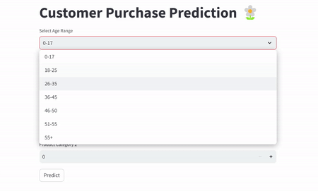

# Google Cloud End-to-End Machine Learning Using Black Friday Dataset to Predict Customer Purchase

## Overview:
In this project, we aim to predict the purchasing amounts of customers during Black Friday by utilizing various features like age, gender, and marital status. We will follow all the steps of a Data Science lifecycle, from data collection to model deployment.
  
## WebApp: 
> Link: https://demo2-uly-56prtrfi3a-uc.a.run.app/
----

### Ocupation Code:
Contain 1-20 different category of occupation
### Product Category_1:
Contain 1-18 Cloth category product
### Product Category_2:
Contain 1-18 Electronics product category

## Introduction
In the realm of retail, Black Friday stands as a pivotal moment, attracting customers with its enticing deals and discounts. To capitalize on this lucrative opportunity, businesses strive to anticipate consumer behavior and tailor their strategies accordingly. Machine learning (ML) offers a powerful tool in this regard, enabling businesses to leverage data to make informed decisions. In this project, a Black Friday dataset was analyzed using ML classification models, with the aim of predicting individual customer purchases. Among the various models tested, XGBoost regression emerged as the most effective in identifying likely purchases. This model holds significant promise for businesses looking to optimize their sales strategies during the busiest shopping day of the year.

## System Architecture
The system architecture involves machine learning techniques applied to the Black Friday dataset to predict purchase amounts using various regression models. The evaluation metrics used are root mean squared error (RMSE) and R-squared. Data preprocessing steps include handling missing values, converting categorical features to numerical features, and normalizing numerical features. Models are trained and evaluated on the training set, and the best model is deployed to a production environment.

## Dataset 
| Column ID |         Column Name        | Data type |           Description           | Masked |
|:---------:|:--------------------------:|:---------:|:-------------------------------:|--------|
|     0     |           User_ID          |   int64   |      Unique Id of customer      | False  |
|     1     |         Product_ID         |   object  |       Unique Id of product      | False  |
|     2     |           Gender           |   object  |         Sex of customer         | False  |
|     3     |             Age            |   object  |         Age of customer         | False  |
|     4     |         Occupation         |   int64   |   Occupation code of customer   | True   |
|     5     |        City_Category       |   object  |         City of customer        | True   |
|     6     | Stay_In_Current_City_Years |   object  | Number of years of stay in city | False  |
|     7     |       Marital_Status       |   int64   |    Marital status of customer   | False  |
|     8     |     Product_Category_1     |   int64   |       Category of product       | True   |
|     9     |     Product_Category_2     |  float64  |       Category of product       | True   |
|     10    |     Product_Category_3     |  float64  |       Category of product       | True   |
|     11    |          Purchase          |   int64   |         Purchase amount         | False  |

## Model Used
Linear Regression
Decision Tree Regression
Random Forest Regression
XGBoost Regression

## Evaluation and Analysis 
The XGBoost regression model achieved the highest accuracy with an RMSE of 2931.73 and an R-squared of 0.6589, making it the best-suited model for the Black Friday dataset.

## Conclusion
The project explored four machine learning models to predict customer purchase amounts on Black Friday using the Black Friday dataset. The XGBoost regression model achieved the best performance, demonstrating the potential of ML models to aid businesses in targeting marketing campaigns and improving sales strategies.

Contact Information
For questions or support, please contact Ulya Tsaniya at ulyaatsaniya@gmail.com.

